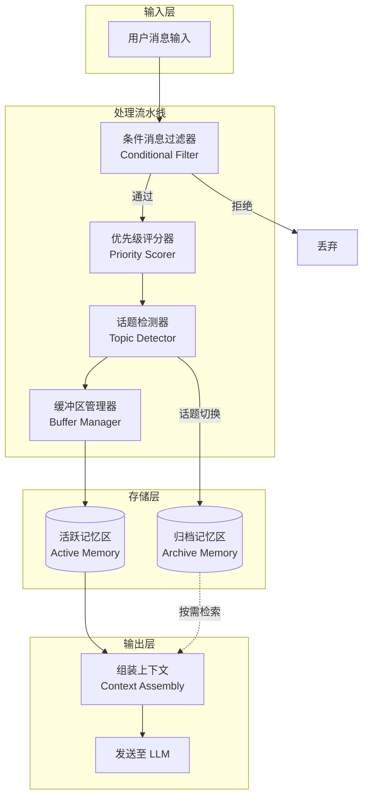
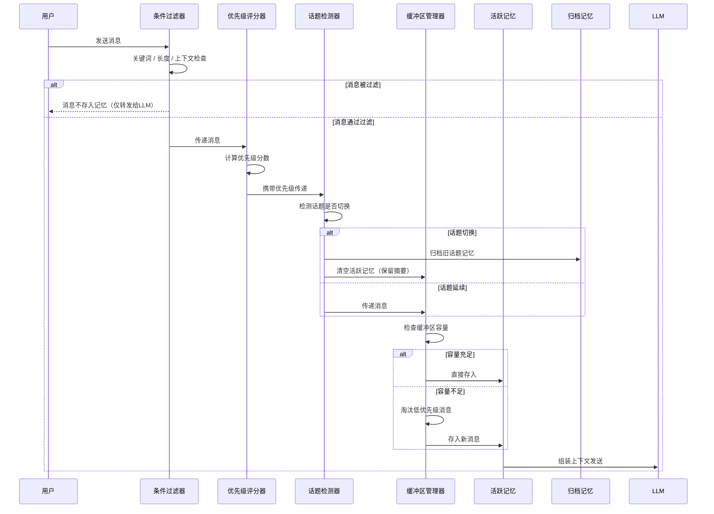
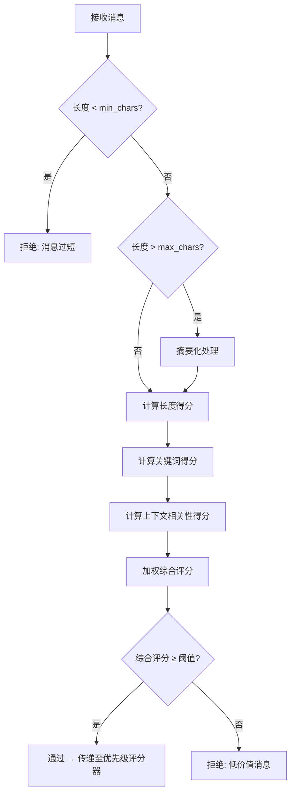
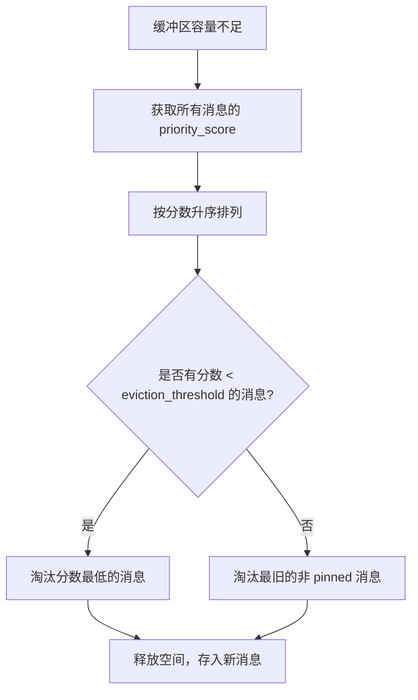
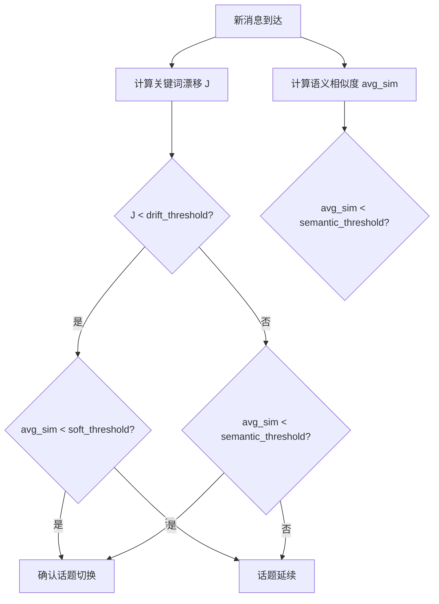
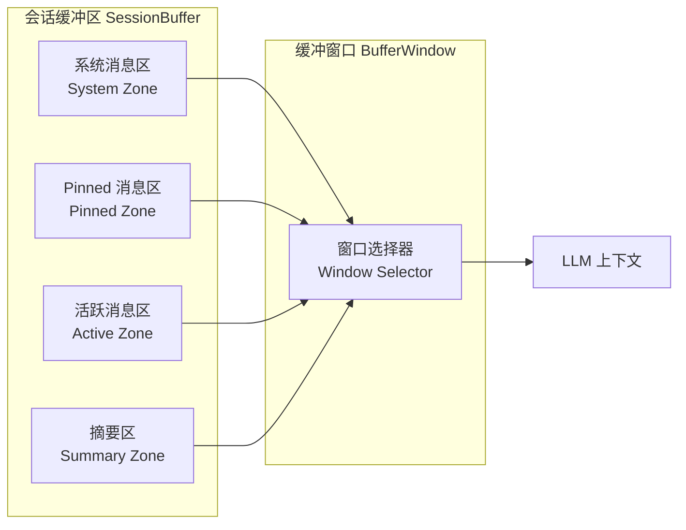
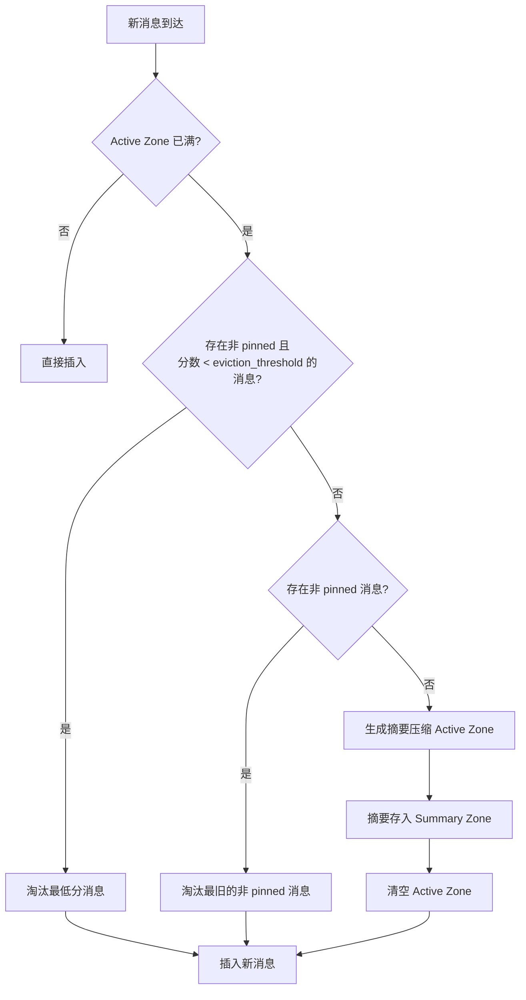
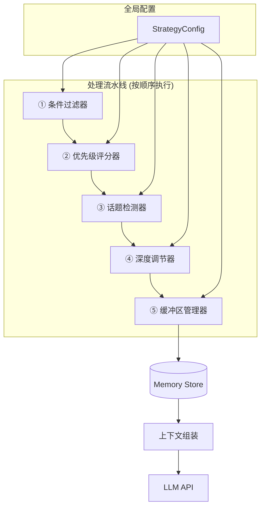

# 动态消息记忆策略设计规格书

> **版本**: v1.0  
> **日期**: 2026-06-20  
> **状态**: Draft

---

## 目录

1. [概述与目标](#1-概述与目标)
2. [系统架构](#2-系统架构)
3. [模块一：条件消息过滤器](#3-模块一条件消息过滤器)
4. [模块二：动态记忆深度调节](#4-模块二动态记忆深度调节)
5. [模块三：优先级消息保留](#5-模块三优先级消息保留)
6. [模块四：话题切换检测与记忆清理](#6-模块四话题切换检测与记忆清理)
7. [模块五：会话缓冲区与缓冲窗口](#7-模块五会话缓冲区与缓冲窗口)
8. [集成与配置](#8-集成与配置)
9. [数据结构与 API 契约](#9-数据结构与-api-契约)

---

## 1. 概述与目标

### 1.1 问题陈述

在智能对话系统中，传统的消息记忆方案通常采用固定长度的滑动窗口来保存对话历史。这种方式存在以下问题：

- **冗余信息堆积**：无关紧要的消息（如寒暄、重复确认）占用有限的上下文窗口
- **记忆深度固定**：无法根据对话阶段动态调整保留的消息数量
- **重要信息丢失**：关键的用户需求或决策性消息可能被普通消息挤出窗口
- **话题干扰**：旧话题的历史信息可能干扰新话题的对话质量

### 1.2 设计目标

| 目标 | 描述 |
|------|------|
| **上下文相关性** | 保留与当前对话情境最相关的消息 |
| **资源效率** | 在有限 token 预算内最大化记忆的信息密度 |
| **自适应深度** | 根据对话轮数、话题变化动态调节记忆容量 |
| **优先级感知** | 确保高优先级消息（关键需求、决策点）不被淘汰 |
| **可扩展性** | 各模块可独立启用、组合或替换 |

### 1.3 核心设计原则

1. **存储前过滤** — 消息入库前先经过条件筛选，拒绝低价值内容
2. **动态优于静态** — 所有阈值和容量均可根据运行时状态自适应调整
3. **优先级驱动淘汰** — 当空间不足时，优先淘汰低优先级消息而非最旧消息
4. **话题隔离** — 不同话题的记忆相互独立，避免跨话题干扰

---

## 2. 系统架构

### 2.1 整体架构图



### 2.2 端到端消息处理流程



### 2.3 模块职责概览

| 模块 | 职责 | 输入 | 输出 |
|------|------|------|------|
| 条件过滤器 | 判断消息是否值得存储 | 原始消息 | 通过/拒绝决策 |
| 优先级评分器 | 为消息分配重要性分数 | 通过过滤的消息 | 带优先级分数的消息 |
| 话题检测器 | 识别话题变化并触发清理 | 带优先级的消息 + 历史 | 话题标签 + 清理指令 |
| 缓冲区管理器 | 管理活跃记忆的容量与淘汰 | 标记消息 + 当前缓冲状态 | 更新后的记忆列表 |
| 上下文组装器 | 从记忆中构建 LLM 输入 | 活跃记忆 + 归档摘要 | 格式化上下文 |

---

## 3. 模块一：条件消息过滤器

### 3.1 功能概述

条件消息过滤器是消息进入记忆系统的第一道关卡。它在消息存储前对其进行多维度评估，只有满足条件的消息才被允许进入后续处理流程。

### 3.2 过滤维度

#### 3.2.1 关键词过滤

基于预定义的关键词集合对消息进行匹配评分：

```
过滤规则配置:
  keyword_rules:
    boost_keywords:        # 提升保留概率的关键词
      - "需求"
      - "必须"
      - "重要"
      - "确认"
      - "决定"
    suppress_keywords:     # 降低保留概率的关键词
      - "嗯"
      - "好的"
      - "收到"
      - "谢谢"
    threshold: 0.3         # 关键词匹配得分阈值
```

**匹配逻辑**：

- 计算消息中 `boost_keywords` 的命中数，每个命中 +1 分
- 计算消息中 `suppress_keywords` 的命中数，每个命中 -0.5 分
- 归一化到 [0, 1] 区间后与阈值比较

#### 3.2.2 消息长度阈值

过短或过长的消息可能都不适合作为记忆存储：

```
长度过滤规则:
  length_rules:
    min_chars: 5            # 低于此长度的消息不存储
    max_chars: 500          # 超过此长度的消息进行摘要后存储
    sweet_spot: [20, 200]   # 最佳长度区间，得分为1
```

**长度评分函数**：

```
score = 1.0                              if min_chars ≤ len ≤ sweet_spot[1]
score = (len - min_chars) / (sweet_spot[0] - min_chars)  if min_chars < len < sweet_spot[0]
score = max(0.3, 1.0 - (len - sweet_spot[1]) / (max_chars - sweet_spot[1]))
                                         if sweet_spot[1] < len ≤ max_chars
score = 0                                if len < min_chars or len > max_chars
```

#### 3.2.3 上下文相关性评分

通过计算当前消息与最近 N 条消息的语义相似度来判断消息是否处于有效对话上下文中：

- 与最近 3 条消息的平均相似度 ≥ 0.6 → 高相关性（score = 1.0）
- 平均相似度在 [0.3, 0.6) → 中相关性（score = 0.6）
- 平均相似度 < 0.3 → 低相关性（score = 0.3，但不直接拒绝，交由话题检测器处理）

### 3.3 过滤决策流程



### 3.4 综合评分公式

```
final_score = w_keyword × keyword_score
            + w_length × length_score
            + w_context × context_score

默认权重:
  w_keyword = 0.4
  w_length  = 0.2
  w_context = 0.4

通过条件: final_score ≥ filter_threshold (默认 0.35)
```

---

## 4. 模块二：动态记忆深度调节

### 4.1 功能概述

动态记忆深度调节根据对话的当前轮数来调整系统应保留的消息数量。核心思想：对话初期应尽量多存消息以建立上下文；对话深入后逐步压缩记忆，保留精华而非全量。

### 4.2 调节模型

#### 4.2.1 基于轮数的深度缩放

```
参数配置:
  depth_config:
    max_depth: 20              # 最大记忆深度（消息条数）
    min_depth: 5               # 最小记忆深度
    decay_start_turn: 5        # 从第几轮开始衰减
    decay_rate: 0.85           # 每轮衰减系数
    floor_after_turn: 30       # 多少轮后达到最小深度
```

#### 4.2.2 深度计算公式

```
if current_turn ≤ decay_start_turn:
    memory_depth = max_depth
elif current_turn ≥ floor_after_turn:
    memory_depth = min_depth
else:
    effective_turns = current_turn - decay_start_turn
    memory_depth = max(
        min_depth,
        floor(max_depth × decay_rate ^ effective_turns)
    )
```

#### 4.2.3 深度变化曲线示意

```
记忆深度
  20 |████████████████████
     |                    ████
  15 |                        ████
     |                            ███
  10 |                               ██
     |                                 ██
   5 |                                   ████████████████
     +-----|-----|-----|-----|-----|-----|-----|----→ 对话轮数
     0     5    10    15    20    25    30    35
           ↑decay_start              ↑floor_after_turn
```

### 4.3 分阶段存储策略

| 阶段 | 轮数范围 | 策略 | 记忆深度 |
|------|----------|------|----------|
| **建立期** | 1–5 轮 | 全量存储，建立完整上下文 | max_depth (20) |
| **衰减期** | 6–30 轮 | 逐步压缩，淘汰低优先级消息 | 20 → 5 (指数衰减) |
| **稳定期** | 30+ 轮 | 仅保留高优先级 + 最近消息 | min_depth (5) |

### 4.4 与优先级模块的联动

当 `memory_depth` 缩小时，缓冲区管理器并非简单丢弃最旧的消息，而是：

1. 先按优先级分数排序
2. 保留 top-N 高优先级消息 + 最近 K 条消息（保证连续性）
3. N + K = 当前 `memory_depth`

```
保留配额分配:
  priority_quota = floor(memory_depth × 0.6)    # 60% 给高优先级
  recency_quota  = memory_depth - priority_quota # 40% 给最近消息
```

---

## 5. 模块三：优先级消息保留

### 5.1 功能概述

为每条消息计算一个优先级分数，当缓冲区空间不足时，系统优先淘汰低优先级消息，确保关键信息始终保留在活跃记忆中。

### 5.2 优先级评分模型

优先级分数由以下维度加权计算：

```
priority_score = w_kw × keyword_weight
               + w_intent × intent_signal
               + w_recency × recency_score
               + w_role × role_weight
```

#### 5.2.1 关键词权重 (keyword_weight)

```
keyword_categories:
  critical (weight=1.0):
    - "需求", "必须", "不允许", "安全", "密码", "bug", "故障"
  important (weight=0.7):
    - "建议", "方案", "设计", "计划", "截止日期", "预算"
  normal (weight=0.3):
    - 一般性描述、讨论
  trivial (weight=0.1):
    - 寒暄、确认、表情
```

#### 5.2.2 用户意图信号 (intent_signal)

通过简单的意图分类为消息赋予信号分：

| 意图类型 | 信号分 | 示例 |
|----------|--------|------|
| 需求声明 | 1.0 | "我需要一个登录功能" |
| 问题提出 | 0.8 | "这个接口怎么调用？" |
| 决策确认 | 0.9 | "就用方案A吧" |
| 信息补充 | 0.6 | "对了，数据库用的是PostgreSQL" |
| 闲聊/确认 | 0.1 | "好的"、"明白了" |

#### 5.2.3 时间衰减 (recency_score)

```
recency_score = 1.0 / (1 + α × messages_since)

参数:
  α = 0.05    # 衰减速度，值越大衰减越快

示例:
  最新一条消息:  recency = 1.0
  5 条前的消息:  recency = 1.0 / (1 + 0.05×5) = 0.80
  20 条前的消息: recency = 1.0 / (1 + 0.05×20) = 0.50
```

#### 5.2.4 角色权重 (role_weight)

```
role_weights:
  user:    0.8    # 用户消息更重要（包含需求）
  assistant: 0.5  # 助手消息为辅助参考
  system:  1.0    # 系统消息始终保留
```

#### 5.2.5 默认权重配置

```
priority_weights:
  w_kw:      0.30
  w_intent:  0.35
  w_recency: 0.20
  w_role:    0.15
```

### 5.3 淘汰策略



**Pinned 消息机制**：

- 分数 ≥ `pin_threshold`（默认 0.85）的消息被标记为 "pinned"
- Pinned 消息不会被自动淘汰
- 当 pinned 消息数量超过 `max_pinned`（默认 5）时，最低分的 pinned 消息降级

### 5.4 优先级队列数据结构

```
PriorityMessageQueue:
  storage: MinHeap<Message>     # 按 priority_score 组织的最小堆
  pinned_set: Set<message_id>   # pinned 消息的快速查找集合
  capacity: int                 # 当前容量上限（来自深度调节模块）

  operations:
    insert(message, score)      # 插入消息 O(log n)
    evict_lowest() → Message    # 淘汰最低优先级消息 O(log n)
    get_top_k(k) → [Message]    # 获取 top-k 高优先级消息 O(k log n)
    pin(message_id)             # 标记消息为 pinned O(1)
    unpin(message_id)           # 取消 pinned 标记 O(1)
```

---

## 6. 模块四：话题切换检测与记忆清理

### 6.1 功能概述

当用户的对话主题发生切换时，系统自动检测并执行记忆清理，将旧话题的记忆归档，为新话题提供干净的上下文空间。

### 6.2 话题检测算法

#### 6.2.1 基于关键词漂移的检测

```
算法: Keyword Drift Detection

输入: 当前消息 current_msg, 最近 N 条消息 recent_msgs

步骤:
  1. 提取 current_msg 的关键词集合 KW_current
  2. 提取 recent_msgs 的关键词集合 KW_recent
  3. 计算 Jaccard 相似度:
     J = |KW_current ∩ KW_recent| / |KW_current ∪ KW_recent|
  4. 如果 J < topic_drift_threshold (默认 0.15):
     → 判定为话题切换
```

#### 6.2.2 基于语义相似度的检测

```
算法: Semantic Similarity Detection

输入: 当前消息嵌入 emb_current, 最近 N 条消息嵌入 emb_recent

步骤:
  1. 计算 emb_current 与 emb_recent 中每条消息的余弦相似度
  2. 取平均相似度 avg_sim
  3. 如果 avg_sim < semantic_threshold (默认 0.4):
     → 判定为话题切换
  4. 如果 avg_sim < soft_threshold (默认 0.55):
     → 触发二次确认（结合关键词漂移结果）
```

#### 6.2.3 复合判定逻辑



### 6.3 话题切换响应策略

当检测到话题切换时，执行以下步骤：

```
TopicSwitchHandler:
  procedure handle(switch_event):
    1. 生成旧话题摘要
       summary = summarize(active_memory.get_messages_for_current_topic())

    2. 归档旧话题记忆
       archive.store(
         topic_id: current_topic_id,
         summary: summary,
         messages: active_memory.get_messages_for_current_topic(),
         timestamp: now()
       )

    3. 清理活跃记忆
       active_memory.clear_except(
         keep: [system_messages, pinned_messages, summary_as_context]
       )

    4. 初始化新话题上下文
       active_memory.insert(
         TopicContextMessage(
           topic_id: new_topic_id,
           previous_summary: summary,  # 可选：保留为参考
           start_turn: current_turn
         )
       )
```

### 6.4 归档记忆检索

归档的记忆不会完全丢弃，在以下场景可被检索恢复：

| 触发条件 | 检索策略 |
|----------|----------|
| 用户提及旧话题关键词 | 按关键词匹配检索相关归档 |
| 用户明确回溯 ("之前说的…") | 按时间范围检索最近归档 |
| 上下文不足时 | 检索所有归档的摘要作为补充 |

---

## 7. 模块五：会话缓冲区与缓冲窗口

### 7.1 功能概述

会话缓冲区是记忆系统的核心存储容器，负责管理消息的存储、淘汰和检索。缓冲窗口则定义了 LLM 实际可见的消息范围。两者配合实现高效的上下文管理。

### 7.2 缓冲区架构



#### 7.2.1 缓冲区各区域职责

| 区域 | 容量 | 内容 | 淘汰策略 |
|------|------|------|----------|
| System Zone | 固定 (1–3 条) | 系统提示、角色设定 | 不淘汰 |
| Pinned Zone | 上限 max_pinned (5) | 高优先级消息 | 仅手动或降级淘汰 |
| Active Zone | 动态 (depth - pinned) | 普通对话消息 | 优先级淘汰 / LRU |
| Summary Zone | 固定 (1–2 条) | 压缩后的历史摘要 | 被新摘要替换 |

### 7.3 动态缓冲容量调节

#### 7.3.1 前重后轻策略

对话前期分配更多缓冲空间，后期逐步收缩：

```
buffer_capacity(current_turn):
  if current_turn ≤ warm_up_turns (默认 3):
    return max_buffer_size           # 全量分配
  else:
    reduction = (current_turn - warm_up_turns) × step_down
    return max(min_buffer_size, max_buffer_size - reduction)

参数:
  max_buffer_size: 20 (条)
  min_buffer_size: 5 (条)
  warm_up_turns: 3
  step_down: 0.5 (条/轮)
```

#### 7.3.2 容量调节与深度调节的关系

缓冲容量 (`buffer_capacity`) 是物理上限，记忆深度 (`memory_depth`) 是逻辑目标。两者的协调规则：

```
effective_capacity = min(buffer_capacity, memory_depth)

当 buffer_capacity > memory_depth:
  → 缓冲空间富余，可预加载归档摘要
当 buffer_capacity < memory_depth:
  → 缓冲空间紧张，强制触发淘汰至 effective_capacity
```

### 7.4 缓冲窗口选择策略

缓冲窗口决定哪些消息进入 LLM 的上下文：

```
WindowSelectionStrategy:

  1. 始终包含: System Zone 全部消息
  2. 始终包含: Summary Zone 全部消息
  3. 始终包含: Pinned Zone 全部消息
  4. 按 token 预算填充 Active Zone:
     remaining_tokens = total_budget - used_tokens(system + summary + pinned)
     从最近的消息开始向前填充，直到 remaining_tokens 耗尽
  5. 如果仍有剩余 token 预算:
     从归档摘要中按相关性填充
```

### 7.5 溢出处理



### 7.6 摘要压缩机制

当 Active Zone 满且无法通过单条淘汰释放足够空间时，触发摘要压缩：

```
SummaryCompression:
  trigger: active_zone_count == capacity AND no_evictable_messages

  procedure:
    1. 将 Active Zone 中最早的一半消息提取
    2. 调用 LLM 生成压缩摘要 (≤ 100 tokens)
    3. 将摘要追加到 Summary Zone
       - 如果 Summary Zone 已满，先合并已有摘要
    4. 从 Active Zone 移除已摘要的消息
```

---

## 8. 集成与配置

### 8.1 模块集成流水线



### 8.2 全局配置参数汇总

```yaml
dynamic_memory_strategy:
  # --- 条件过滤器 ---
  filter:
    enabled: true
    keyword_rules:
      boost_keywords: ["需求", "必须", "重要", "确认", "决定", "bug", "故障"]
      suppress_keywords: ["嗯", "好的", "收到", "谢谢"]
    length_rules:
      min_chars: 5
      max_chars: 500
      sweet_spot: [20, 200]
    context_rules:
      recent_window: 3
      high_similarity: 0.6
      low_similarity: 0.3
    weights:
      keyword: 0.4
      length: 0.2
      context: 0.4
    threshold: 0.35

  # --- 优先级评分器 ---
  priority:
    enabled: true
    weights:
      keyword: 0.30
      intent: 0.35
      recency: 0.20
      role: 0.15
    recency_decay: 0.05
    pin_threshold: 0.85
    max_pinned: 5
    eviction_threshold: 0.25

  # --- 话题检测器 ---
  topic_detection:
    enabled: true
    method: composite          # composite | keyword_only | semantic_only
    keyword_drift_threshold: 0.15
    semantic_threshold: 0.4
    soft_threshold: 0.55
    recent_window: 5
    archive_enabled: true
    auto_clear_on_switch: true

  # --- 深度调节器 ---
  depth:
    enabled: true
    max_depth: 20
    min_depth: 5
    decay_start_turn: 5
    decay_rate: 0.85
    floor_after_turn: 30
    priority_quota_ratio: 0.6

  # --- 缓冲区管理器 ---
  buffer:
    max_buffer_size: 20
    min_buffer_size: 5
    warm_up_turns: 3
    step_down: 0.5
    token_budget: 4000
    summary_trigger: auto       # auto | manual | disabled
    summary_max_tokens: 100
```

### 8.3 扩展点

| 扩展点 | 说明 | 实现方式 |
|--------|------|----------|
| 自定义过滤规则 | 添加新的过滤维度（如情感分析） | 实现 `FilterPlugin` 接口 |
| 自定义优先级模型 | 替换默认的评分模型 | 实现 `PriorityScorer` 接口 |
| 自定义话题检测 | 使用更复杂的 NLP 模型 | 实现 `TopicDetector` 接口 |
| 自定义淘汰策略 | FIFO、LRU、随机等 | 实现 `EvictionPolicy` 接口 |
| 自定义摘要策略 | 不同压缩比、不同摘要模型 | 实现 `Summarizer` 接口 |

### 8.4 模块启用/禁用组合

各模块可独立启用或禁用，系统支持以下典型组合：

| 场景 | 过滤器 | 优先级 | 话题检测 | 深度调节 | 缓冲区 |
|------|--------|--------|----------|----------|--------|
| 简单聊天机器人 | ✅ | ❌ | ❌ | ❌ | ✅ (固定容量) |
| 客服系统 | ✅ | ✅ | ✅ | ❌ | ✅ |
| 长对话助手 | ✅ | ✅ | ✅ | ✅ | ✅ (动态容量) |
| 知识问答 | ✅ | ✅ | ❌ | ❌ | ✅ |

---

## 9. 数据结构与 API 契约

### 9.1 核心数据结构

```
┌─────────────────────────────────────────────────────┐
│                    Message                           │
├─────────────────────────────────────────────────────┤
│  id:          string          # 唯一标识             │
│  role:        enum            # user|assistant|system│
│  content:     string          # 消息文本内容          │
│  timestamp:   datetime        # 消息创建时间          │
│  turn_number: int             # 所在对话轮次          │
│  topic_id:    string          # 所属话题 ID           │
│  metadata:    Map<string,any> # 扩展元数据            │
├─────────────────────────────────────────────────────┤
│  # 以下字段由处理流水线填充                           │
│  filter_score:    float|null  # 过滤评分             │
│  priority_score:  float|null  # 优先级评分           │
│  is_pinned:       bool        # 是否被钉住           │
│  intent_type:     string|null # 识别的意图类型        │
└─────────────────────────────────────────────────────┘

┌─────────────────────────────────────────────────────┐
│                TopicContext                          │
├─────────────────────────────────────────────────────┤
│  topic_id:    string          # 话题唯一 ID          │
│  keywords:    list<string>    # 话题关键词集合        │
│  start_turn:  int             # 话题起始轮次          │
│  end_turn:    int|null        # 话题结束轮次          │
│  summary:     string|null     # 话题摘要（归档后填充） │
│  is_active:   bool            # 是否为当前活跃话题     │
└─────────────────────────────────────────────────────┘

┌─────────────────────────────────────────────────────┐
│              SessionBuffer                           │
├─────────────────────────────────────────────────────┤
│  system_zone:  list<Message>  # 系统消息区           │
│  pinned_zone:  list<Message>  # 钉住消息区           │
│  active_zone:  list<Message>  # 活跃消息区           │
│  summary_zone: list<string>   # 摘要区              │
│  capacity:     int            # 当前总容量上限        │
│  current_topic: TopicContext  # 当前话题上下文        │
├─────────────────────────────────────────────────────┤
│  insert(message: Message)                            │
│  evict(message_id: string) → Message                 │
│  get_window(token_budget: int) → list<Message>       │
│  get_messages_by_topic(topic_id: string) → list      │
│  compress_oldest(ratio: float)                       │
│  clear_active_zone()                                 │
└─────────────────────────────────────────────────────┘

┌─────────────────────────────────────────────────────┐
│              ArchiveStore                            │
├─────────────────────────────────────────────────────┤
│  entries: list<ArchiveEntry>                         │
├─────────────────────────────────────────────────────┤
│  store(entry: ArchiveEntry)                          │
│  search(query: string, top_k: int) → list<ArchiveEntry>│
│  get_by_topic(topic_id: string) → ArchiveEntry|null  │
│  get_recent(limit: int) → list<ArchiveEntry>         │
└─────────────────────────────────────────────────────┘

┌─────────────────────────────────────────────────────┐
│              ArchiveEntry                            │
├─────────────────────────────────────────────────────┤
│  topic_id:    string                                 │
│  summary:     string                                 │
│  messages:    list<Message>                          │
│  archived_at: datetime                               │
│  keywords:    list<string>                           │
└─────────────────────────────────────────────────────┘
```

### 9.2 API 契约

#### 9.2.1 消息处理 API

```
POST /memory/process

Request:
{
  "session_id": "string",
  "message": {
    "role": "user | assistant | system",
    "content": "string"
  }
}

Response:
{
  "stored": true,
  "filter_score": 0.72,
  "priority_score": 0.65,
  "topic_detected": "topic_001",
  "topic_switched": false,
  "current_depth": 15,
  "buffer_usage": "12/20",
  "actions_taken": ["inserted_to_active_zone"]
}
```

#### 9.2.2 上下文获取 API

```
GET /memory/context?session_id={id}&token_budget={budget}

Response:
{
  "context_messages": [
    { "role": "system", "content": "..." },
    { "role": "user", "content": "..." },
    ...
  ],
  "total_tokens": 3200,
  "token_budget": 4000,
  "included_zones": ["system", "summary", "pinned", "active"],
  "active_topic": {
    "topic_id": "topic_001",
    "summary": null
  }
}
```

#### 9.2.3 记忆管理 API

```
GET  /memory/state?session_id={id}
     → 返回当前记忆状态（各区域消息数量、话题信息等）

POST /memory/pin
     → 手动钉住指定消息
     Body: { "session_id": "...", "message_id": "..." }

POST /memory/clear
     → 手动清理记忆
     Body: { "session_id": "...", "scope": "active | all | topic", "topic_id": "..." }

GET  /memory/archive?session_id={id}&topic_id={topic}
     → 检索归档记忆
```

### 9.3 接口定义

```
interface ConditionalFilter:
  evaluate(message: Message, context: ConversationContext) → FilterResult

interface PriorityScorer:
  score(message: Message, history: list<Message>) → float

interface TopicDetector:
  detect(current_message: Message, history: list<Message>) → TopicResult

interface DepthAdjuster:
  get_depth(current_turn: int, config: DepthConfig) → int

interface BufferManager:
  insert(message: Message, score: float)
  evict() → Message
  get_window(token_budget: int) → list<Message>
  compress(ratio: float)
  clear(zone: Zone)

interface ContextAssembler:
  assemble(buffer: SessionBuffer, archive: ArchiveStore, token_budget: int) → list<Message>
```

---

## 附录 A：典型场景走查

### 场景 1：短对话（5 轮以内）

```
用户: 我想设计一个登录页面                → 存储 (优先级: 高, 需求声明)
助手: 好的，需要什么功能？                 → 存储 (优先级: 中)
用户: 需要用户名、密码输入框和记住我选项     → 存储 (优先级: 高, 需求细节)
助手: 是否需要社交账号登录？               → 存储 (优先级: 中)
用户: 嗯                                  → 过滤拒绝 (过短 + suppress关键词)
```

**结果**: 活跃记忆 4 条消息，系统保留了全部有效上下文。

### 场景 2：话题切换

```
[前 10 轮讨论数据库设计]
用户: 好，数据库这块就这样。接下来聊聊前端框架选型    → 检测到话题切换
系统动作:
  1. 生成数据库话题摘要: "讨论了使用 PostgreSQL，设计了 users 和 orders 表..."
  2. 归档 10 条旧消息 + 摘要
  3. 清空 Active Zone（保留 system + pinned 消息）
  4. 新话题开始，buffer 重新分配

用户: 你觉得 React 和 Vue 哪个好？         → 存储 (新话题首条，高优先级)
```

### 场景 3：长对话（50 轮）

```
第 50 轮时:
  - memory_depth = min_depth = 5
  - buffer_capacity ≈ min_buffer_size = 5
  - Active Zone: 2 条最近消息 + 3 条高优先级历史
  - Summary Zone: 包含 3 个话题摘要
  - Archive: 45+ 条消息已归档

当用户问 "我之前提到的那个需求是什么？":
  → 系统从 Archive 中检索匹配的历史消息
  → 临时注入到上下文供 LLM 参考
```

---

## 附录 B：性能考量

| 操作 | 时间复杂度 | 优化策略 |
|------|-----------|----------|
| 关键词过滤 | O(k × n), k=关键词数, n=消息长度 | 使用 Aho-Corasick 多模式匹配 |
| 语义相似度计算 | O(d), d=嵌入维度 | 缓存嵌入向量，增量更新 |
| 优先级堆操作 | O(log n) | 标准二叉堆实现 |
| 话题切换检测 | O(N × d), N=窗口大小 | 预计算并缓存嵌入 |
| 摘要压缩 | LLM 调用延迟 | 异步执行，不阻塞主流程 |
| 归档检索 | O(A × k), A=归档数 | 使用向量索引加速 |

---

> **文档结束** — 本规格书定义了动态消息记忆策略的完整架构设计，各模块可独立实现并按接口契约集成。
